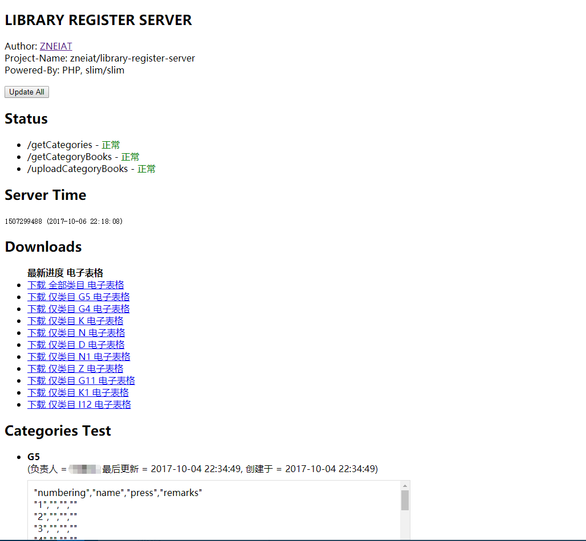

# Library Register Android Server

<p style="text-align: center;">

</p>

> 書記 (Android)，一个适用于图书室 多人协作共同完成图书录入任务 的移动工作站

这是 書記 (Android) 的服务器端

[書記 Android 客户端 传送门](https://github.com/qwqcode/library-register-android)

> 注：本 API Server 仅适用于 [書記 Android 客户端](https://github.com/qwqcode/library-register-android)，暂不适用于新版 [書記 Online](https://github.com/qwqcode/book-register)

## Quick Start

```bash
composer install
cp database-config.example.php database-config.php
```

## Screenshots


